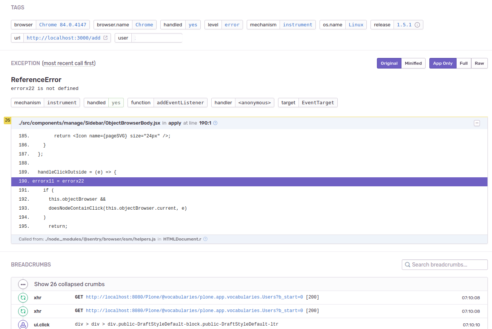
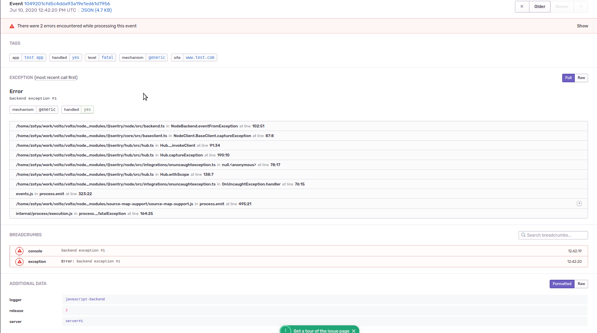

# Integration with SENTRY

## Prerequisities
1. In Sentry create a new organization, and add a project to it
2. On the projects settings page, from Client Keys (DSN), take the SENTRY_DSN
3. Create an API Token: on the top left corner, click on your name -> API keys and create a new token, "project:write" scope should be selected.

**Note:**  Instructions tested with Sentry 9.1.2

## Setup
Volto creates bundles of the source codes, if an error is sent to sentry, it will only show the traceback in the bundles. To have nice traceback, we have to upload the source code and source map in sentry.
This doesn't have to be done manually, we can configure our volto application to do all the steps automatically.

There are 2 ways to configure the application:

### 1. Buildtime
This can be used when the application is deployed directly on a host machine, and built locally.

The configuration is done using environment variables:

 - SENTRY_DSN - required to enable the feature
 - SENTRY_URL - the url of sentry
 - SENTRY_AUTH_TOKEN - the authentication token for sentry
 - SENTRY_ORG - the name of the organization in sentry
 - SENTRY_PROJECT -the name of the project in sentry
 - SENTRY_RELEASE - release number
 - SENTRY_FRONTEND_CONFIGURATION - optional, here we can specify TAGS
   and ADDITIONAL DATA for the messages from the browser we send to sentry
 - SENTRY_BACKEND_CONFIGURATION - same as SENTRY_FRONTEND_CONFIGURATION, but we configure the messages from the backend

If these env variables are configured, when the app is built, a new release will be created in sentry, and the source code and source maps will be uploaded it.
After starting the application if an error will occure, the errors will be sent to sentry, and will be linked to the specified release.

Example of usage:

```bash
SENTRY_URL=https://mysentry.com SENTRY_AUTH_TOKEN=foo SENTRY_ORG=my_organization SENTRY_PROJECT=new_project SENTRY_RELEASE=2.0.0 SENTRY_DSN=https://boo@sentry.com/1 yarn build
node build/server.js
```
### 2. Runtime
In case you plan to use the application using docker, you will not want to have the sentry setup in the docker image.
The configuration for setting up sentry on runtime is very similar as how we set it up for buildtime, but with some small differences:

 - SENTRY_URL - the url of sentry
 - SENTRY_AUTH_TOKEN - the authentication token for sentry
 - SENTRY_ORG - the name of the organization in sentry
 - SENTRY_PROJECT -the name of the project in sentry
 - SENTRY_RELEASE - release number
 - RAZZLE_SENTRY_DSN - required to enable the feature
 - RAZZLE_SENTRY_FRONTEND_CONFIGURATION - optional, here we can specify TAGS
   and ADDITIONAL DATA for the messages from the browser we send to sentry
 - RAZZLE_SENTRY_BACKEND_CONFIGURATION - same as RAZZLE_SENTRY_FRONTEND_CONFIGURATION, but we configure the messages from the backend
 - RAZZLE_SENTRY_RELEASE - release number, should be the same as SENTRY_RELEASE

In the entrypoint of our docker image we have to add the ./create-sentry-release.sh script. When the container is started, this script will check in sentry if the specified release already exists, if not, it will create it and upload the source code and the source maps.
The script can be executed also manually and if we want to overwrite the existing files in sentry, we can use the --force  flag:

```bash
./create-sentry-release.sh --force
```
Example of entrypoint:

```bash
#!/usr/bin/env bash
set -Ex

function apply_path {
    mainjs=./build/server.js
    bundlejs=./build/public/static/js/*.js
    test -f $mainjs

    echo "Check that we have API_PATH and API vars"
    test -n "$API_PATH"

    sed -i "s#VOLTO_API_PATH#${API_PATH}#g" $mainjs
    sed -i "s#VOLTO_API_PATH#${API_PATH}#g" $bundlejs
    sed -i "s#VOLTO_INTERNAL_API_PATH#${INTERNAL_API_PATH}#g" $mainjs
    sed -i "s#VOLTO_INTERNAL_API_PATH#${INTERNAL_API_PATH}#g" $bundlejs

    gzip -fk $mainjs
}

# Should we monkey patch?
test -n "$API_PATH" && apply_path

./create-sentry-release.sh

echo "Starting Volto"
exec "$@"
```

Starting with docker:

```bash
docker run -p 3000:3000 -p 3001:3001 -e SENTRY_URL=https://mysentry.com -e SENTRY_AUTH_TOKEN=foo -e SENTRY_ORG=my_organization -e SENTRY_PROJECT=new_project -e SENTRY_RELEASE=2.0.0 -e RAZZLE_SENTRY_DSN=https://boo@sentry.com/1 -e RAZZLE_SENTRY_RELEASE=2.0.0 volto-app:latest
```

Or using docker-compose:

```yaml
version: '3'
services:
  volto:
    build: volto
    ports:
      - 3000:3000
      - 3001:3001
    environment:
      - SENTRY_URL=https://mysentry.com
      - SENTRY_AUTH_TOKEN=foo
      - SENTRY_ORG=my_organization
      - SENTRY_PROJECT=new_project
      - SENTRY_RELEASE=2.0.0
      - RAZZLE_SENTRY_DSN=https://boo@sentry.com/1
      - RAZZLE_SENTRY_RELEASE=2.0.0
```

## Configuration options

This applies to both SENTRY_FRONTEND_CONFIGURATION and SENTRY_BACKEND_CONFIGURATION 

**Note:** In case you are using buildtime configuration you have to use SENTRY_FRONTEND_CONFIGURATION and SENTRY_BACKEND_CONFIGURATION.

But if you are using runtime configuration, use RAZZLE_SENTRY_FRONTEND_CONFIGURATION and RAZZLE_SENTRY_BACKEND_CONFIGURATION

We have the possibility to add TAGS and ADDITIONAL DATA for our messages for categorization in SENTRY. We can configure these 2 variables separately, as we might want to separate the messages from frontend and backend.
Example of configurations:

```json
{
  "tags":
  {
      "site":"www.test.com",
      "app":"test_app"
  },
  "extras":
  {
      "logger":"javascript-frontend"
  },
  "environment": "development",
  "serverName": "server #1",
  "maxBreadcrumbs": 50
}
```
Example of usage with buildtime setup:

```bash
SENTRY_URL=https://mysentry.com SENTRY_AUTH_TOKEN=foo SENTRY_ORG=my_organization SENTRY_PROJECT=new_project SENTRY_RELEASE=2.0.0 SENTRY_DSN=https://boo@sentry.com/1 SENTRY_FRONTEND_CONFIG='{"tags":{"site":"www.test.com","app":"test_app"},"extras":{"logger":"javascript-frontend", "release":"1.4.1"}}' SENTRY_BACKEND_CONFIG='{"tags":{"site":"www.test.com","app":"test_app"} yarn build
node build/server.js
```
 Example with docker-compose:

```yaml
version: '3'
services:
  volto:
    build: volto
    ports:
      - 3000:3000
      - 3001:3001
    environment:
      - SENTRY_URL=https://mysentry.com
      - SENTRY_AUTH_TOKEN=foo
      - SENTRY_ORG=my_organization
      - SENTRY_PROJECT=new_project
      - SENTRY_RELEASE=2.0.0
      - RAZZLE_SENTRY_DSN=https://boo@sentry.com/1
      - RAZZLE_SENTRY_RELEASE=2.0.0
      - RAZZLE_SENTRY_FRONTEND_CONFIGURATION={"tags":{"site":"www.test.com","app":"test_app"},"extras":{"logger":"javascript-frontend"}}
      - RAZZLE_SENTRY_BACKEND_CONFIGURATION={"tags":{"site":"www.test.com","app":"test_app"},"extras":{"logger":"javascript-backend", "server":"server#1"}}
```

## Example of messages in SENTRY

1. List of messages

2. Messages from the frontend, with it's own TAGS and ADDITIONAL DATA

3. Messages from the backend, with it's own TAGS and ADDITIONAL DATA

